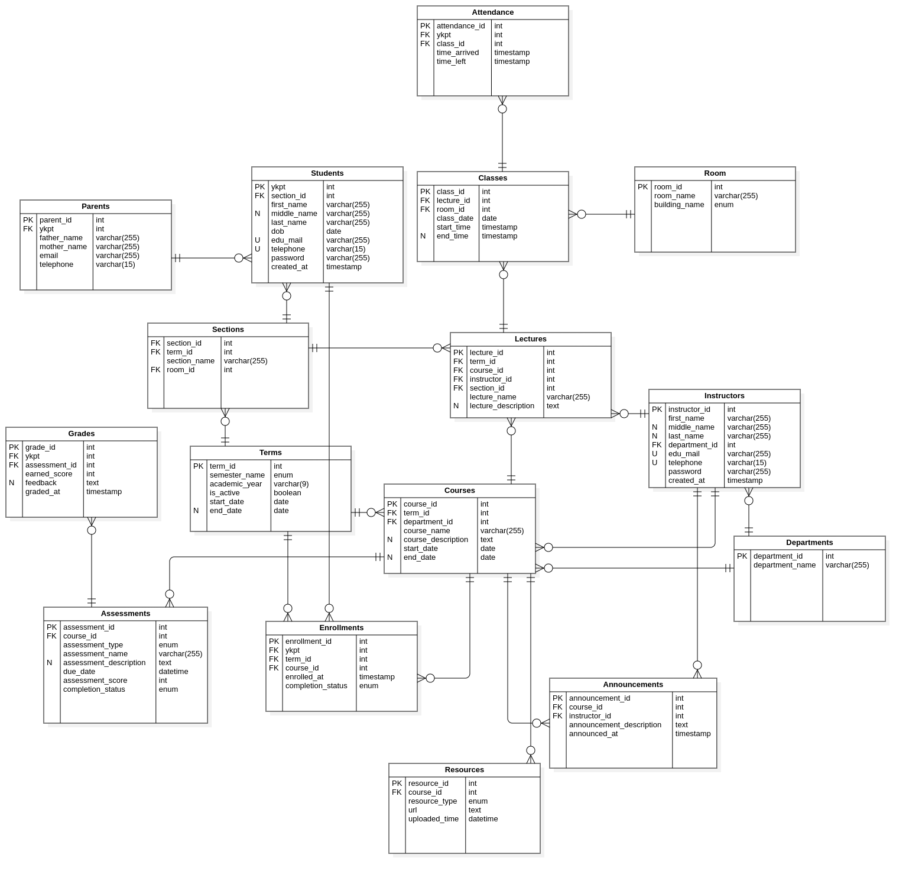

## ⛃ Database Design for UCSY LMS
[](LICENSE)
[](https://github.com/ammdevl)[](http://makeapullrequest.com)
[](https://github.com/ammdevl/ucsy-lms-db/issues)

## 📋 Table of Contents

- [About](#-about)
- [Repository Structure](#-repository-structure)
- [Technologies & Tools](#️-technologies--tools)
- [Getting Started](#-getting-started)
- [ER Diagram](#-er-diagram)
- [Database Design Details](#-database-design-details)
- [Analytical Queries](#-analytical-queries)
- [Group Members](#-group-members)
- [Contributing](#-contributing)
- [License](#-license)
- [Contact](#-contact)

## 📖 About
This repository documents the formal Database Design and Implementation for the University of Computer Studies, Yangon (UCSY) Learning Management System. It showcases a complete data modeling workflow—from initial requirement analysis and ER Diagramming to optimized SQL schema development.

This project was created for the **Fundamental Database Management System (IS-201)** course, Faculty of Information Science, Semester III, 2025–2026 Academic Year.

## 📁 Repository Structure
```bash
ucsy-lms-db/
├── design/
│   └── ucsy_lms_db_erd.mdj          # StarUML ER diagram model
├── docs/
│   ├── sem_III_dbms_project.tex      # LaTeX academic report
│   ├── ucsy-logo.png
│   ├── ucsy_lms_db_erd_mysql.png     # ER diagram (MySQL Workbench)
│   ├── ucsy_lms_db_erd_staruml.png   # ER diagram (StarUML)
│   ├── departments.png               # Table data screenshots
│   ├── room.png
│   ├── terms.png
│   ├── sections.png
│   ├── students.png
│   ├── parents.png
│   ├── instructors.png
│   ├── courses.png
│   ├── lectures.png
│   ├── classes.png
│   ├── enrollments.png
│   ├── assessments.png
│   ├── attendance.png
│   ├── resources.png
│   ├── grades.png
│   ├── announcements.png
│   ├── query1.png – query8.png       # Query execution screenshots
├── sql_script/
│   └── ucsy-lms-db.sql              # Main SQL script
├── .gitignore
├── LICENSE
└── README.md
```

## 🛠️ Technologies & Tools
| Category | Tool | Purpose |
| --- | --- | --- |
| Design | StarUML | Conceptual & Logical ER Diagrams |
| Database | MySQL (Server/Workbench/Shell) | Schema Implementation & Query Execution |
| Publishing | LaTeX | Academic Documentation & Formatting |
| Version Control | Git & GitHub | Version control and remote hosting |

## 🚀 Getting Started

### Prerequisites
- MySQL Server (v8.0 or compatible)
- MySQL Workbench (recommended for visual query execution)

### Installation
1. **Clone the repository**
   ```bash
   git clone https://github.com/ammdevl/ucsy-lms-db.git
   ```

2. **Navigate to the project**
   ```bash
   cd ucsy-lms-db
   ```

3. **Run the SQL script**
   Open `sql_script/ucsy-lms-db.sql` in MySQL Workbench and execute it. The script will:
   - Drop any existing `ucsy_lms_db` database
   - Create a fresh database with 16 tables
   - Populate all tables with seed data

> **Note:** The script contains comprehensive seed data including 10 departments, 80 rooms, 10 terms, 60 sections, 112 students, 100 instructors, ~60 courses, and corresponding records across all other tables.

## 📐 ER Diagram



The full ER diagram model can be opened in StarUML using the file at [`design/ucsy_lms_db_erd.mdj`](design/ucsy_lms_db_erd.mdj).

## 📃 Database Design Details

The database includes **16 entities**: Departments, Room, Terms, Sections, Students, Parents, Instructors, Courses, Lectures, Classes, Enrollments, Assessments, Announcements, Attendance, Resources, and Grades.

### Entities and Attributes

#### 1. Departments
Categorizes the various academic departments within the university.

* **department_id** (PK): Unique identifier.
* **department_name**: Official name of the department.

---

#### 2. Room
Stores information about physical locations where classes are held.

* **room_id** (PK): Unique identifier.
* **room_name**: Name or number of the room.
* **building_name**: Campus building (A, B, C, D, E, F, Ext1, or Ext2).

---

#### 3. Terms
Defines academic periods and their active status.

* **term_id** (PK): Unique identifier.
* **semester_name**: Roman numeral (I through X).
* **academic_year**: School year (e.g., 2023-2024).
* **is_active**: Boolean flag for the current term.
* **start_date**: Term start date.
* **end_date**: Term end date.

---

#### 4. Sections
Student cohorts assigned to a particular term and room.

* **section_id** (PK): Unique identifier.
* **term_id** (FK): Reference to the academic term.
* **section_name**: Name of the student group.
* **room_id** (FK): Primary room assigned to this section.

---

#### 5. Students
Personal details and academic placement for each student.

* **ykpt** (PK): Unique student identifier.
* **term_id** (FK): Reference to the assigned term.
* **first_name**: First name.
* **middle_name**: Middle name.
* **last_name**: Last name.
* **dob**: Date of birth.
* **edu_mail**: Official university email (Unique).
* **telephone**: Contact phone number (Unique).
* **password**: Encrypted login credential.
* **created_at**: Account creation timestamp.

---

#### 6. Parents
Contact information for parents or guardians.

* **parent_id** (PK): Unique identifier.
* **ykpt** (FK): Reference to the student.
* **father_name**: Father's name.
* **mother_name**: Mother's name.
* **email**: Parent's email.
* **telephone**: Parent's phone number.

---

#### 7. Instructors
Profiles for faculty members teaching courses.

* **instructor_id** (PK): Unique identifier.
* **first_name**: First name.
* **middle_name**: Middle name.
* **last_name**: Last name.
* **department_id** (FK): Home department.
* **edu_mail**: Official faculty email (Unique).
* **telephone**: Contact phone number (Unique).
* **password**: Encrypted login credential.
* **created_at**: Account creation timestamp.

---

#### 8. Courses
Individual subjects offered by departments.

* **course_id** (PK): Unique identifier.
* **term_id** (FK): Assigned term.
* **department_id** (FK): Offering department.
* **course_name**: Course title.
* **course_description**: Content overview.
* **start_date**: Course start date.
* **end_date**: Course end date.

---

#### 9. Lectures
Links instructors, courses, and sections to teaching sessions.

* **lecture_id** (PK): Unique identifier.
* **term_id** (FK): Current term.
* **course_id** (FK): Associated course.
* **instructor_id** (FK): Teaching instructor.
* **section_id** (FK): Attending student section.
* **lecture_name**: Lecture title.
* **lecture_description**: Topic summary.

---

#### 10. Classes
Individual scheduled instances of lectures in specific rooms.

* **class_id** (PK): Unique identifier.
* **lecture_id** (FK): Parent lecture.
* **room_id** (FK): Assigned room.
* **class_date**: Session date.
* **start_time**: Scheduled start.
* **end_time**: Scheduled end.

---

#### 11. Enrollments
Student-course enrollment with progress tracking.

* **enrollment_id** (PK): Unique identifier.
* **ykpt** (FK): Reference to the student.
* **term_id** (FK): Enrollment term.
* **course_id** (FK): Enrolled course.
* **enrolled_at**: Enrollment timestamp.
* **completion_status**: Not Started, In Progress, or Completed.

---

#### 12. Assessments
Tasks and exams assigned within a course.

* **assessment_id** (PK): Unique identifier.
* **course_id** (FK): Associated course.
* **assessment_type**: Tutorial, Assignment, Lab Test, Quiz, etc.
* **assessment_name**: Assessment title.
* **assessment_description**: Instructions or details.
* **due_date**: Submission deadline.
* **assessment_score**: Maximum possible points.
* **completion_status**: General status.

---

#### 13. Announcements
Instructor broadcasts to specific courses.

* **announcement_id** (PK): Unique identifier.
* **course_id** (FK): Relevant course.
* **instructor_id** (FK): Posting instructor.
* **announcement_description**: Announcement content.
* **announced_at**: Post timestamp.

---

#### 14. Attendance
Student presence records for class sessions.

* **attendance_id** (PK): Unique identifier.
* **ykpt** (FK): Reference to the student.
* **class_id** (FK): Class session.
* **time_arrived**: Arrival timestamp.
* **time_left**: Departure timestamp.

---

#### 15. Resources
Educational materials provided in courses.

* **resource_id** (PK): Unique identifier.
* **course_id** (FK): Associated course.
* **resource_type**: Video, Slides, TextBook, etc.
* **url**: Resource web address or file path.
* **uploaded_time**: Upload timestamp.

---

#### 16. Grades
Student performance on specific assessments.

* **grade_id** (PK): Unique identifier.
* **ykpt** (FK): Student being graded.
* **assessment_id** (FK): Specific assessment.
* **earned_score**: Points achieved.
* **feedback**: Instructor comments.
* **graded_at**: Grading timestamp.

### Database Relationship — Cardinality

| Relationship | Type | Description |
| --- | --- | --- |
| **Departments — Instructors** | One-to-Many | One department employs multiple instructors. |
| **Departments — Courses** | One-to-Many | One department manages multiple courses. |
| **Room — Classes** | One-to-Many | One room hosts multiple class sessions. |
| **Terms — Sections** | One-to-Many | One term contains multiple sections. |
| **Terms — Enrollments** | One-to-Many | One term manages many enrollments. |
| **Terms — Courses** | One-to-Many | One term hosts various courses. |
| **Sections — Students** | One-to-Many | One section has multiple students. |
| **Sections — Lectures** | One-to-Many | One section attends multiple lectures. |
| **Students — Parents** | Many-to-One | Multiple students (siblings) can share a parent record. |
| **Students — Enrollments** | One-to-Many | One student has multiple enrollment records. |
| **Instructors — Courses** | One-to-Many | One instructor conducts multiple courses. |
| **Instructors — Lectures** | One-to-Many | One instructor manages multiple lectures. |
| **Instructors — Announcements** | One-to-Many | One instructor posts multiple announcements. |
| **Courses — Enrollments** | One-to-Many | One course has many students enrolled. |
| **Courses — Lectures** | One-to-Many | One course has multiple lectures. |
| **Courses — Assessments** | One-to-Many | One course contains multiple assessments. |
| **Courses — Announcements** | One-to-Many | One course has multiple announcements. |
| **Courses — Resources** | One-to-Many | One course provides multiple resources. |
| **Lectures — Classes** | One-to-Many | One lecture has multiple class sessions. |
| **Classes — Attendance** | One-to-Many | One class session has attendance per student. |
| **Assessments — Grades** | One-to-Many | One assessment has grade entries per student. |

## 📊 Analytical Queries

The SQL script includes 8 analytical queries that demonstrate practical database operations:

| # | Query | Description |
| --- | --- | --- |
| 1 | Enrollment by Department | Total students enrolled per department, sorted by highest. |
| 2 | In-Progress Courses | Count of courses currently in progress for a specific term. |
| 3 | Late Attendance | Number of late attendance records per student. |
| 4 | Top Instructor | Instructor with the highest number of assigned lectures. |
| 5 | Past-Due Assessments | Assessments past their due date and not completed. |
| 6 | Student Enrollment History | Enrollment history and completion status for a specific student. |
| 7 | Course Resources | Total number of academic resources for a specific course. |
| 8 | Class Attendance | Students who attended a specific class with arrival times. |

Execution screenshots for each query are available in the [`docs/`](docs/) directory.

## 👥 Group Members

| No. | Name | YKPT | Role |
| --- | --- | --- | --- |
| 1 | Aung Myint Myat | 23046 | Project Leader |
| 2 | Aung Khant Kyaw | 23023 | Designer |
| 3 | Phyo Khant Kyaw | 23027 | Designer |
| 4 | Min Khant Aung | 23036 | Designer |
| 5 | Chan Myaw Htike | 23057 | SQL |
| 6 | Ye Kyaw Swar | 23050 | SQL |
| 7 | Htet Thu Aung | 23019 | SQL |
| 8 | Aung Oo Khant | 23031 | Documentation |
| 9 | Nyan Linn Htet | 23016 | Documentation |

## 🤝 Contributing

While this is primarily an academic portfolio project, suggestions for improvements, bug reports, and code reviews are welcome. Please open an issue or reach out directly.

## 📄 License

This repository is licensed under the MIT License — see the [LICENSE](LICENSE) file for details.

## 📧 Contact

**Aung Myint Myat**
- GitHub: [@ammdevl](https://github.com/ammdevl)
- Discord: [@ammdevl](https://discord.com/ammdevl)
- Repository: [ucsy-lms-db](https://github.com/ammdevl/ucsy-lms-db)

---

<div align="center">
  <sub>Built with ❤️ during my academic journey</sub>
</div>
